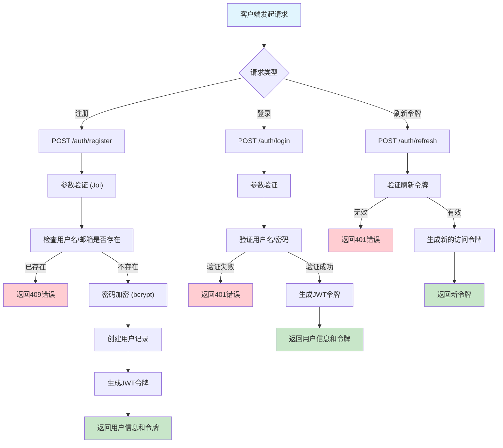
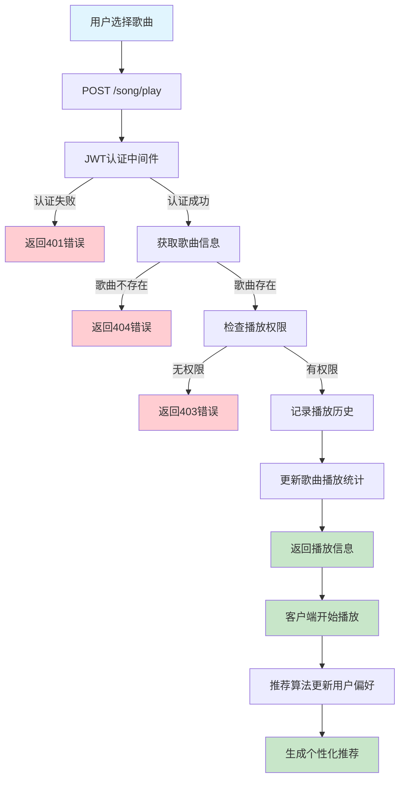
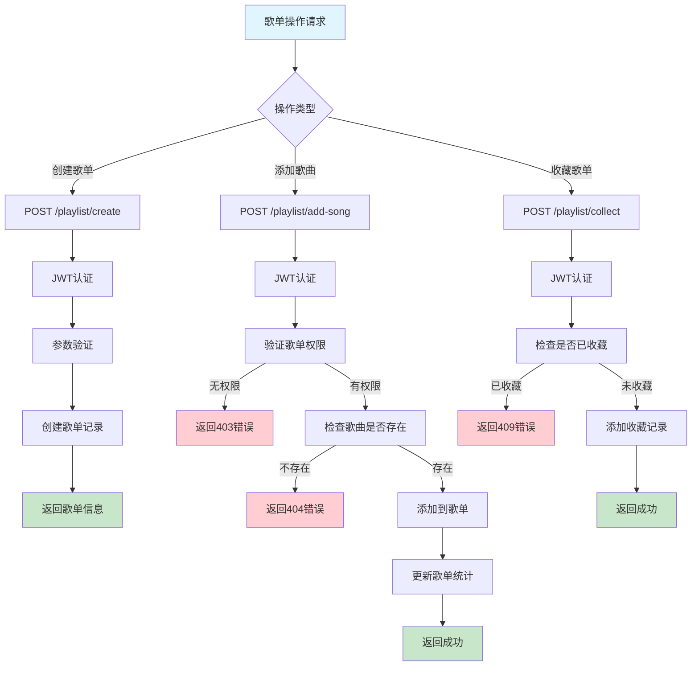
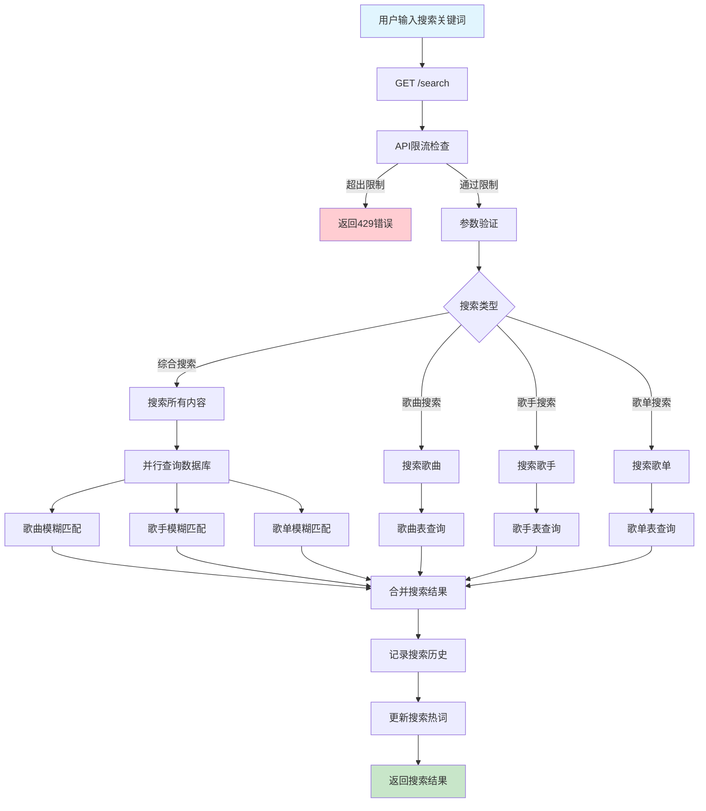
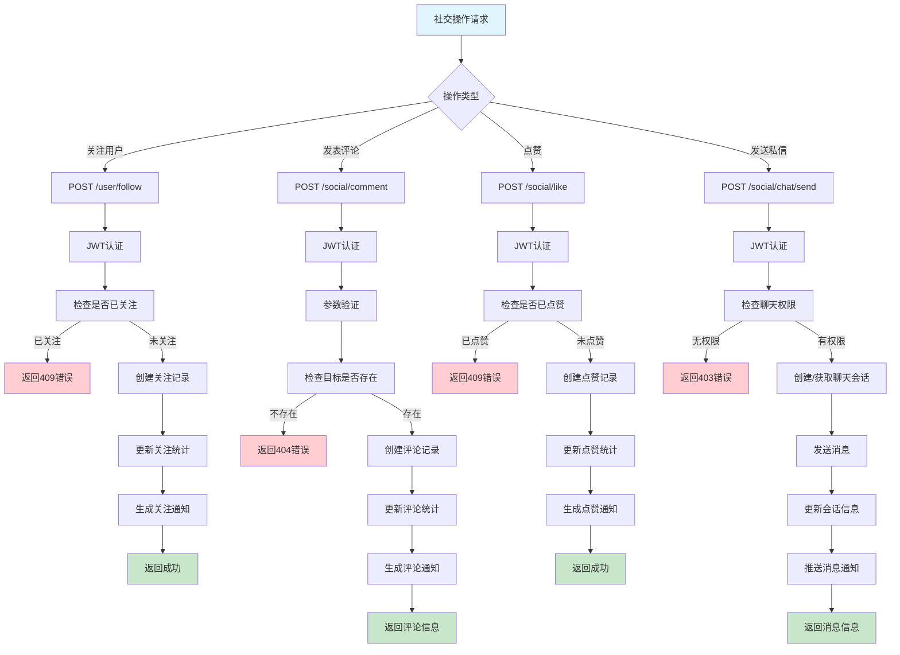
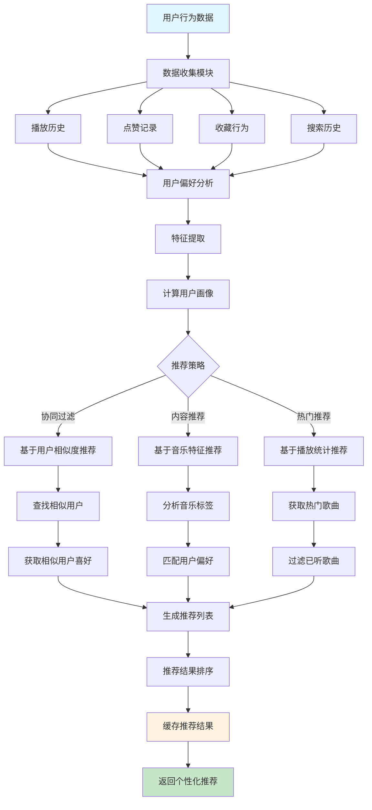
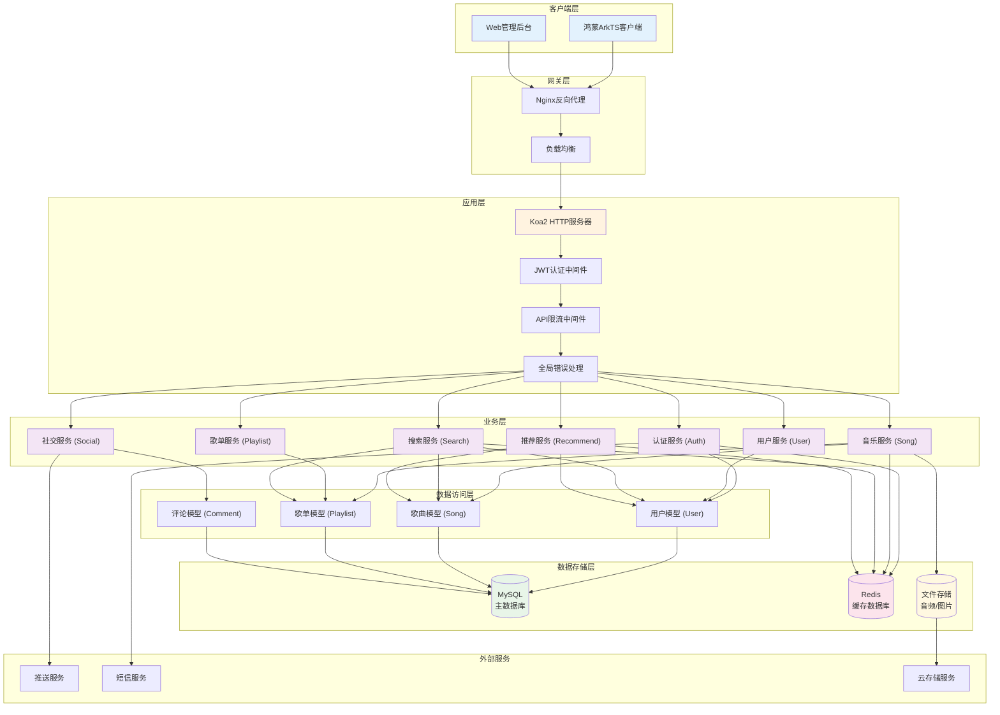
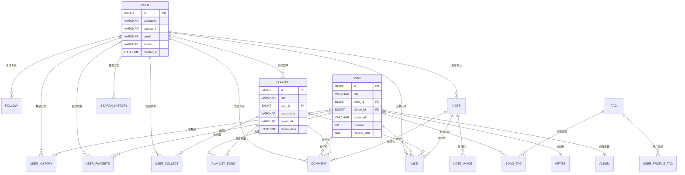

# 🎵 网易云音乐仿制项目 - 后端API服务

## 📋 项目概述

这是一个基于 **Node.js + Koa2** 开发的音乐应用后端API服务，仿照网易云音乐APP的功能设计。项目采用前后端分离架构，为鸿蒙ArkTS前端应用提供完整的RESTful API服务。

## 📖 文档目录

- [📋 项目概述](#-项目概述)
- [📁 项目目录结构](#-项目目录结构)
- [🏗️ 架构设计](#️-架构设计)
  - [分层架构](#分层架构)
  - [业务逻辑流程图](#业务逻辑流程图)
  - [模块划分](#模块划分)
- [🚀 快速开始](#-快速开始)
- [📚 API接口文档](#-api接口文档)
- [🔧 开发说明](#-开发说明)
- [📝 开发任务](#-开发任务)
- [🧪 测试](#-测试)
- [📊 部署](#-部署)

### 🎯 技术栈

- **框架**: Node.js + Koa2
- **数据库**: MySQL 8.0+
- **缓存**: Redis
- **包管理**: pnpm
- **认证**: JWT
- **参数验证**: Joi
- **日志**: Winston
- **测试**: Jest
- **代码规范**: ESLint

### 🌟 核心特性

- ✅ **完整的用户系统** - 注册、登录、用户信息管理
- ✅ **音乐播放功能** - 歌曲管理、播放历史、推荐算法
- ✅ **歌单系统** - 创建、管理、收藏歌单
- ✅ **搜索功能** - 全文搜索歌曲、歌手、歌单、用户
- ✅ **社交功能** - 关注、评论、点赞、私信
- ✅ **笔记系统** - 音乐笔记发布与分享
- ✅ **安全保障** - JWT认证、API限流、参数验证
- ✅ **性能优化** - Redis缓存、数据库索引、分页查询

## 📁 项目目录结构

```
my-server/
├── src/                        # 源代码目录
│   ├── app.js                  # 应用程序入口文件
│   ├── config/                 # 配置文件目录
│   │   ├── index.js           # 主配置文件
│   │   └── database.js        # 数据库连接配置
│   ├── controllers/           # 控制器层
│   │   ├── auth-controller.js # 认证控制器
│   │   ├── user-controller.js # 用户控制器
│   │   ├── song-controller.js # 歌曲控制器
│   │   ├── playlist-controller.js # 歌单控制器
│   │   ├── search-controller.js # 搜索控制器
│   │   ├── note-controller.js # 笔记控制器
│   │   └── social-controller.js # 社交控制器
│   ├── services/              # 业务逻辑层
│   │   ├── user-service.js    # 用户业务逻辑
│   │   ├── song-service.js    # 歌曲业务逻辑
│   │   ├── playlist-service.js # 歌单业务逻辑
│   │   ├── search-service.js  # 搜索业务逻辑
│   │   ├── note-service.js    # 笔记业务逻辑
│   │   └── social-service.js  # 社交业务逻辑
│   ├── models/                # 数据模型层
│   │   └── user.js           # 用户数据模型
│   ├── routes/                # 路由层
│   │   ├── index.js          # 主路由文件
│   │   ├── auth-routes.js    # 认证路由
│   │   ├── user-routes.js    # 用户路由
│   │   ├── song-routes.js    # 歌曲路由
│   │   ├── playlist-routes.js # 歌单路由
│   │   ├── search-routes.js  # 搜索路由
│   │   ├── note-routes.js    # 笔记路由
│   │   └── social-routes.js  # 社交路由
│   ├── middleware/            # 中间件
│   │   ├── error-handler.js  # 全局错误处理
│   │   ├── auth.js           # JWT认证中间件
│   │   └── rate-limit.js     # API限流中间件
│   └── utils/                 # 工具函数
│       ├── logger.js         # 日志工具
│       └── response.js       # 响应格式化
├── database/                  # 数据库相关
│   ├── create_tables.sql     # 建表脚本
│   └── README.md             # 数据库说明文档
├── doc/                       # 文档目录
│   ├── 产品功能文档.md        # 产品功能设计
│   └── 表结构设计.md          # 数据库设计
├── logs/                      # 日志文件目录
├── uploads/                   # 文件上传目录
├── tests/                     # 测试文件目录
├── package.json              # 项目配置文件
└── README.md                 # 项目说明文档
```

## 🏗️ 架构设计

### 分层架构

项目采用经典的三层架构模式：

```
┌─────────────────┐
│   Controller    │  ← 控制器层：处理HTTP请求，参数验证，调用Service
├─────────────────┤
│    Service      │  ← 业务逻辑层：核心业务逻辑，事务管理
├─────────────────┤
│     Model       │  ← 数据访问层：数据库操作，SQL查询
└─────────────────┘
```

### 📋 目录导航

- [🔐 用户认证流程](#1--用户认证流程)
- [🎵 音乐播放流程](#2--音乐播放流程)  
- [📝 歌单管理流程](#3--歌单管理流程)
- [🔍 搜索流程](#4--搜索流程)
- [💬 社交互动流程](#5--社交互动流程)
- [🎯 推荐算法流程](#6--推荐算法流程)
- [🏗️ 系统整体架构](#7--系统整体架构流程)
- [📊 数据库关系图](#8--数据库关系图)

### 业务逻辑流程图

#### 1. 🔐 用户认证流程



#### 2. 🎵 音乐播放流程



#### 3. 📝 歌单管理流程



#### 4. 🔍 搜索流程



#### 5. 💬 社交互动流程



#### 6. 🎯 推荐算法流程



#### 7. 🏗️ 系统整体架构流程



#### 8. 📊 数据库关系图



### 模块划分

根据产品功能文档，项目划分为以下核心模块：

#### 1. 👤 用户模块 (`/user`)
- **功能**: 用户注册、登录、个人信息管理、关注关系
- **接口前缀**: `/user`
- **文件**: 
  - Controller: `user-controller.js`
  - Service: `user-service.js`
  - Model: `user.js`
  - Routes: `user-routes.js`

#### 2. 🔐 认证模块 (`/auth`)
- **功能**: JWT认证、令牌管理、登录验证
- **接口前缀**: `/auth`
- **文件**:
  - Controller: `auth-controller.js`
  - Middleware: `auth.js`
  - Routes: `auth-routes.js`

#### 3. 🎵 歌曲模块 (`/song`)
- **功能**: 歌曲管理、播放记录、推荐算法、喜欢功能
- **接口前缀**: `/song`
- **文件**:
  - Controller: `song-controller.js`
  - Service: `song-service.js`
  - Routes: `song-routes.js`

#### 4. 📝 歌单模块 (`/playlist`)
- **功能**: 歌单创建、管理、收藏、歌曲添加/移除
- **接口前缀**: `/playlist`
- **文件**:
  - Controller: `playlist-controller.js`
  - Service: `playlist-service.js`
  - Routes: `playlist-routes.js`

#### 5. 🔍 搜索模块 (`/search`)
- **功能**: 全文搜索、搜索建议、热门搜索、搜索历史
- **接口前缀**: `/search`
- **文件**:
  - Controller: `search-controller.js`
  - Service: `search-service.js`
  - Routes: `search-routes.js`

#### 6. 📖 笔记模块 (`/note`)
- **功能**: 音乐笔记发布、图片管理、笔记编辑
- **接口前缀**: `/note`
- **文件**:
  - Controller: `note-controller.js`
  - Service: `note-service.js`
  - Routes: `note-routes.js`

#### 7. 💬 社交模块 (`/social`)
- **功能**: 评论、点赞、私信、通知管理
- **接口前缀**: `/social`
- **文件**:
  - Controller: `social-controller.js`
  - Service: `social-service.js`
  - Routes: `social-routes.js`

## 🚀 快速开始

### 环境要求

- Node.js >= 16.0.0
- pnpm >= 7.0.0
- MySQL >= 8.0
- Redis >= 6.0

### 安装依赖

```bash
# 安装项目依赖
pnpm install
```

### 环境配置

1. 复制环境变量配置文件
```bash
cp .env.example .env
```

2. 编辑 `.env` 文件，配置数据库和Redis连接信息
```bash
# 数据库配置
DB_HOST=localhost
DB_PORT=3306
DB_USER=root
DB_PASSWORD=your-password
DB_NAME=netease_music_db

# Redis配置
REDIS_HOST=localhost
REDIS_PORT=6379
REDIS_PASSWORD=

# JWT密钥
JWT_SECRET=your-super-secret-jwt-key
```

### 数据库初始化

```bash
# 创建数据库
mysql -u root -p
CREATE DATABASE netease_music_db CHARACTER SET utf8mb4 COLLATE utf8mb4_unicode_ci;

# 执行建表脚本
mysql -u root -p netease_music_db < database/create_tables.sql
```

### 启动服务

```bash
# 开发环境启动
pnpm run dev

# 生产环境启动
pnpm start

# 运行测试
pnpm test
```

## 📚 API接口文档

### 基础信息

- **Base URL**: `http://localhost:3000/api/v1`
- **认证方式**: Bearer Token (JWT)
- **响应格式**: JSON

### 📋 接口规范说明

为了保持接口的一致性和简洁性，本项目采用以下接口规范：

#### 🔧 HTTP方法规范
- **GET**: 用于获取数据的接口
- **POST**: 用于所有修改数据的操作（创建、更新、删除等）

#### 🎯 URL命名规范
- **模块路径**: 所有接口按功能模块分组，使用单数形式
  - 用户模块: `/user/*`
  - 歌曲模块: `/song/*` 
  - 歌单模块: `/playlist/*`
  - 搜索模块: `/search/*`
  - 笔记模块: `/note/*`
  - 社交模块: `/social/*`

#### 📝 参数传递规范
- **GET请求**: 使用URL参数(query string)传递数据
- **POST请求**: 
  - 查询类操作: 使用query参数
  - 修改类操作: 使用request body传递数据
  - 文件上传: 使用multipart/form-data

#### 💡 设计原则
1. **简洁性**: 只使用GET和POST两种HTTP方法，降低前端开发复杂度
2. **一致性**: 所有模块遵循相同的命名和参数传递规范
3. **语义化**: URL路径清晰表达功能含义
4. **RESTful**: 在简化的基础上保持RESTful设计理念

#### 📋 常见操作映射
| 操作类型 | HTTP方法 | URL示例 | 参数位置 |
|---------|---------|---------|----------|
| 获取列表 | GET | `/user/list` | query |
| 获取详情 | GET | `/user/detail/:id` | path + query |
| 创建资源 | POST | `/user/create` | body |
| 更新资源 | POST | `/user/update` | body (包含id) |
| 删除资源 | POST | `/user/remove` | body (包含id) |
| 功能操作 | POST | `/user/follow` | body |

### 主要接口模块

#### 🔐 认证接口 (`/auth`)
```bash
POST /auth/register     # 用户注册
POST /auth/login        # 用户登录
POST /auth/refresh      # 刷新令牌
POST /auth/logout       # 退出登录
GET  /auth/me          # 获取当前用户信息
```

#### 👤 用户接口 (`/user`)
```bash
GET  /user/info              # 获取当前用户信息
POST /user/update            # 更新用户信息
GET  /user/profile/:id       # 获取指定用户信息
GET  /user/history           # 获取播放历史
GET  /user/favorites         # 获取喜欢的歌曲
POST /user/follow            # 关注用户 (body: {userId})
POST /user/unfollow          # 取消关注 (body: {userId})
GET  /user/following         # 获取关注列表
GET  /user/followers         # 获取粉丝列表
POST /user/avatar            # 上传头像
GET  /user/settings          # 获取用户设置
POST /user/settings          # 更新用户设置
```

#### 🎵 歌曲接口 (`/song`)
```bash
GET  /song/list              # 获取歌曲列表
GET  /song/detail/:id        # 获取歌曲详情
POST /song/create            # 创建歌曲
POST /song/update            # 更新歌曲 (body: {id, ...})
POST /song/remove            # 删除歌曲 (body: {id})
POST /song/play              # 播放歌曲 (body: {id})
GET  /song/hot               # 获取热门歌曲
GET  /song/recommend         # 获取推荐歌曲
POST /song/like              # 喜欢歌曲 (body: {songId})
POST /song/unlike            # 取消喜欢 (body: {songId})
```

#### 📝 歌单接口 (`/playlist`)
```bash
GET  /playlist/list          # 获取歌单列表
GET  /playlist/detail/:id    # 获取歌单详情
POST /playlist/create        # 创建歌单
POST /playlist/update        # 更新歌单 (body: {id, ...})
POST /playlist/remove        # 删除歌单 (body: {id})
GET  /playlist/songs/:id     # 获取歌单歌曲
POST /playlist/add-song      # 添加歌曲到歌单 (body: {playlistId, songId})
POST /playlist/remove-song   # 从歌单移除歌曲 (body: {playlistId, songId})
POST /playlist/collect       # 收藏歌单 (body: {playlistId})
POST /playlist/uncollect     # 取消收藏 (body: {playlistId})
GET  /playlist/collected     # 获取收藏的歌单
```

#### 🔍 搜索接口 (`/search`)
```bash
GET  /search                 # 综合搜索 (query: {keyword, type, page, limit})
GET  /search/song            # 搜索歌曲
GET  /search/artist          # 搜索歌手
GET  /search/playlist        # 搜索歌单
GET  /search/user            # 搜索用户
GET  /search/history         # 获取搜索历史
POST /search/history/clear   # 清空搜索历史
GET  /search/hot             # 获取热门搜索
```

#### 📖 笔记接口 (`/note`)
```bash
GET  /note/list              # 获取笔记列表
GET  /note/detail/:id        # 获取笔记详情
POST /note/create            # 发布笔记
POST /note/update            # 更新笔记 (body: {id, ...})
POST /note/remove            # 删除笔记 (body: {id})
GET  /note/my                # 获取我的笔记
POST /note/upload-image      # 上传笔记图片
```

#### 💬 社交接口 (`/social`)
```bash
GET  /social/comment/:targetId    # 获取评论列表 (query: {type})
POST /social/comment              # 发表评论 (body: {targetId, targetType, content})
POST /social/comment/remove       # 删除评论 (body: {commentId})
POST /social/like                 # 点赞 (body: {targetId, targetType})
POST /social/unlike               # 取消点赞 (body: {targetId, targetType})
GET  /social/notification         # 获取通知列表
POST /social/notification/read    # 标记通知已读 (body: {notificationId})
GET  /social/chat/list            # 获取聊天列表
GET  /social/chat/:userId         # 获取聊天记录
POST /social/chat/send            # 发送消息 (body: {userId, content})
```

### 🔧 接口调用示例

#### 获取数据示例 (GET)
```bash
# 获取用户信息
GET /api/v1/user/info
Authorization: Bearer <token>

# 获取歌曲列表 (带分页)
GET /api/v1/song/list?page=1&limit=20&category=pop

# 搜索歌曲
GET /api/v1/search/song?keyword=周杰伦&page=1&limit=10
```

#### 修改数据示例 (POST)
```bash
# 更新用户信息
POST /api/v1/user/update
Authorization: Bearer <token>
Content-Type: application/json

{
  "nickname": "新昵称",
  "avatar": "头像URL"
}

# 关注用户
POST /api/v1/user/follow
Authorization: Bearer <token>
Content-Type: application/json

{
  "userId": 12345
}

# 播放歌曲
POST /api/v1/song/play
Authorization: Bearer <token>
Content-Type: application/json

{
  "id": 98765
}
```

### 统一响应格式

#### 成功响应
```json
{
  "success": true,
  "code": 200,
  "message": "操作成功",
  "data": { ... },
  "pagination": {
    "page": 1,
    "limit": 20,
    "total": 100,
    "totalPages": 5
  },
  "timestamp": "2024-01-15T10:30:00Z"
}
```

#### 错误响应
```json
{
  "success": false,
  "code": 400,
  "message": "参数错误",
  "errorCode": "VALIDATION_ERROR",
  "errors": [
    {
      "field": "email",
      "message": "邮箱格式不正确"
    }
  ],
  "timestamp": "2024-01-15T10:30:00Z"
}
```

## 🔧 开发说明

### 流程图说明

上述业务逻辑流程图展示了系统的核心功能模块：

1. **🔐 用户认证流程** - 涵盖注册、登录、令牌刷新的完整认证机制
2. **🎵 音乐播放流程** - 从用户点击播放到推荐算法更新的完整链路
3. **📝 歌单管理流程** - 歌单创建、歌曲管理、收藏功能的业务逻辑
4. **🔍 搜索流程** - 多类型搜索、结果处理、历史记录的处理流程
5. **💬 社交互动流程** - 关注、评论、点赞、私信等社交功能的实现
6. **🎯 推荐算法流程** - 基于用户行为的个性化推荐算法实现
7. **🏗️ 系统整体架构** - 展示各层级之间的依赖关系和数据流转
8. **📊 数据库关系图** - 核心数据表之间的关联关系

这些流程图为开发人员提供了清晰的实现指导，确保业务逻辑的完整性和一致性。

### 代码规范

- 使用 **ES6+** 语法
- 采用 **async/await** 处理异步操作
- 所有数据库操作必须使用 **参数化查询** 防止SQL注入
- 统一使用 **驼峰命名法** (camelCase)
- 每个函数都要有 **JSDoc注释**

### 错误处理

- 使用自定义 `AppError` 类处理业务错误
- 全局错误处理中间件捕获所有异常
- 详细的错误日志记录

### 安全措施

- JWT令牌认证
- API请求频率限制
- 输入参数验证
- SQL注入防护
- XSS防护

### 性能优化

- Redis缓存热点数据
- 数据库查询优化
- 分页查询避免大数据集
- 响应数据压缩

## 📝 开发任务

当前项目已搭建完整的架构框架，各模块的 **TODO** 实现任务包括：

### 🔨 待实现功能

1. **用户模块完善**
   - [ ] 播放历史查询逻辑
   - [ ] 喜欢歌曲管理
   - [ ] 关注关系管理

2. **歌曲模块开发**
   - [ ] 歌曲CRUD操作
   - [ ] 播放记录统计
   - [ ] 推荐算法实现

3. **歌单模块开发**
   - [ ] 歌单CRUD操作
   - [ ] 歌单歌曲管理
   - [ ] 收藏功能

4. **搜索模块开发**
   - [ ] 全文搜索实现
   - [ ] 搜索历史记录
   - [ ] 热门搜索统计

5. **社交模块开发**
   - [ ] 评论系统
   - [ ] 点赞功能
   - [ ] 私信聊天

6. **笔记模块开发**
   - [ ] 笔记CRUD操作
   - [ ] 图片上传管理
   - [ ] 笔记社交功能

## 🧪 测试

```bash
# 运行所有测试
pnpm test

# 运行测试并监听文件变化
pnpm run test:watch

# 生成测试覆盖率报告
pnpm run test:coverage
```

## 📊 部署

### 生产环境部署

1. **环境变量配置**
```bash
NODE_ENV=production
PORT=3000
JWT_SECRET=your-production-secret
```

2. **使用PM2部署**
```bash
# 安装PM2
npm install -g pm2

# 启动应用
pm2 start src/app.js --name "music-api"

# 查看状态
pm2 status
```

3. **Nginx反向代理**
```nginx
server {
    listen 80;
    server_name your-domain.com;
    
    location /api {
        proxy_pass http://localhost:3000;
        proxy_set_header Host $host;
        proxy_set_header X-Real-IP $remote_addr;
    }
}
```

## 🤝 贡献指南

1. Fork 本仓库
2. 创建特性分支 (`git checkout -b feature/AmazingFeature`)
3. 提交更改 (`git commit -m 'Add some AmazingFeature'`)
4. 推送到分支 (`git push origin feature/AmazingFeature`)
5. 开启 Pull Request

## 📄 许可证

本项目采用 MIT 许可证 - 查看 [LICENSE](LICENSE) 文件了解详情

## 💬 联系方式

- 项目链接: [https://github.com/your-username/netease-music-api](https://github.com/your-username/netease-music-api)
- 问题反馈: [Issues](https://github.com/your-username/netease-music-api/issues)

---

**🎵 让我们一起构建更好的音乐体验！** 